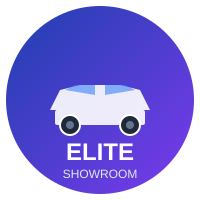

# Elite Showroom — A Cinematic 3D Car Experience

  

Luxury-grade, Blender-authored visuals brought to the web with React Three Fiber, tailored camera stages, and a glassmorphic UI. Explore cars by country, glide through interior/exterior shots, and control the scene’s mood with an iOS‑style brightness control.

---

##  Highlights

- Cinematic camera stages: 0→3 view flow with stage-specific info overlays.
- Blender‑first material authoring for accurate paint, glass, rims, brakes, logos.
- Per‑country cars (Japan/Germany/USA) with consistent platform spin/orientation.
- iOS‑style brightness control that dims the entire showroom lighting — Main View.
- Smooth intro shot: starts at the “door” and glides into the main composition.
- Mobile‑friendly: on‑screen controls, rotate overlay, and responsive UI.

Social sharing ready: `public/image.png` is used as the Open Graph/Twitter preview, and `public/favicon.svg` is the site icon.

---

##  Project Structure

Key files and folders:

- `src/components/ShowroomCanvas.tsx` — Canvas, lighting, car mounts, overlays.
- `src/components/CameraController.tsx` — Stage logic, transitions, intro move, audio.
- `src/components/CarStageOverlay.tsx` — Cinematic per‑stage info cards.
- `src/components/BrightnessControl.tsx` — iOS‑style brightness slider.
- `src/components/GlassSidebar.tsx` — Main View and country selection, responsive.
- `src/store/useShowroom.ts` — Zustand store: camera stage, brightness, car meta.
- `public/modules/...` — GLBs and audio assets.
- `index.html` — SEO/meta, Open Graph/Twitter images, favicon.

---

##  Getting Started

Requirements: Node.js 18+ (use nvm), npm.

1) Clone and install
- Clone this repository and `cd` into the project folder
- Install dependencies with your package manager (npm, pnpm, yarn)

2) Run
- Start the dev server and open the local URL (Vite default is 5173)

---

##  Controls

- Arrow Up/Down — Cycle camera stages (0→3 wrap).
- Interior (stage 2): Hold W to subtly “accelerate” (audio + fov + shake).
- Mobile: On‑screen arrows and W button; landscape prompt if needed.
- Main View only: Right‑side brightness slider.

---

##  Stages & Overlays

- 0 — Name + Year (lower, non‑obstructive)
- 1 — Price (right, min‑height 50px)
- 2 — Horsepower (right, compact)
- 3 — Units Built (left, min‑height 70px)

Blender‑like motion design using framer‑motion (fade, slight blur, scale).

---

##  Architecture Notes

- React + TypeScript + Vite
- @react-three/fiber + drei for 3D & GLTF
- Zustand for app state
- Tailwind + shadcn‑ui for glassmorphic UI

Lighting: Rect area + directional + spot + ambient lights, all scaled by store `brightness`. A global overlay dims the 3D scene/background without affecting UI.

---

##  Assets & Performance

Large GLBs are preloaded via drei (`useGLTF.preload`) and prefetched to warm HTTP caches. For slow networks and production scale, enable these optimizations:

1) Mesh compression
- Export GLBs with Draco and/or Meshopt (Blender exporter/CLI). Expect 5–10× size cuts.
2) LOD strategy
- Load a lightweight LOD instantly, swap to full detail silently.
3) HTTP & CDN
- Serve from a CDN with HTTP/3, Brotli, long‑lived immutable cache headers.
4) Split by feature
- Lazy‑load cars or sub‑scenes only when selected.

Optional: Add a visible loading progress bar (drei’s `useProgress`) for transparency.

---

##  Scripts

- dev — Start Vite dev server
- build — Production build
- preview — Preview the production build
- lint — Lint the codebase

---

##  Configuration

- `index.html` — Title, description, Open Graph/Twitter tags, favicon.
- `tailwind.config.ts` — Design tokens & variants.
- `src/index.css` — Glassmorphism, keyboard overlay, mobile controls.

Environment variables (optional suggestions):

- `VITE_CDN_BASE` to serve assets from a CDN.
- `VITE_ENV` to switch lighting or environment maps.

---

##  Accessibility & UX

- Pointer‑coarse detection for mobile; large tap targets.
- Non‑passive wheel handlers only when needed (prevents page scroll during stage nav).
- Color contrast tuned for luxury dark mode; active sidebar state uses dark text on glass for clarity.

---

##  Social & SEO

- Favicon: `public/favicon.svg`
- Share preview: `public/image.png` via `og:image` and `twitter:image`
- Descriptive title/description for link unfurls

---

##  Roadmap Ideas

- Photo Mode with DoF, exposure, vignetting, and composition guides.
- Lighting “Moods”: Studio / Night Neon / Sunset Garage + environment swaps.
- Buy Mode MVP: inventory filters, transparent pricing, finance calculator, test‑drive booking, reserve with deposit.
- Trade‑in estimator and soft pre‑approval integration.
- Hotspot interactions (open doors, blink indicators, pop hood) with micro‑SFX.
- LOD & streaming pipeline with Meshopt, Draco, and lazy loads.

---

##  License

This project is provided as‑is for demonstration and learning. Replace with your preferred license if you plan to deploy commercially.
